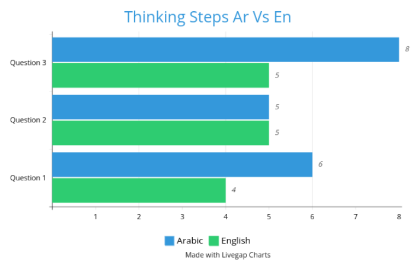

# Compare Between Prompting in Ar Vs En

## Table of content
1. [Arabic question 1](#arabic-question-1)
2. [Arabic question 2](#arabic-question-2)
3. [Arabic question 3](#arabic-question-3)
4. [English question 1](#english-question-1)
5. [English question 2](#english-question-2)
6. [English question 3](#english-question-3)
7. [Sequence of ideas](#sequence-of-ideas)
8. [Quick look](#quick-look)

## Arabic question 1
Okay, so the user is asking "فين 1111". I need to figure out what that means. From the examples, it seems like "فين" means "where" or "where is". So the user is asking where train number 1111 is currently.

Looking at the current data, the train 1111 is a Russian type. Its stop points are Faiyum, Wasta, Ayat, Giza, and Cairo. The arrival times are 12:50 pm, 1:39 pm, 2:05 pm, 2:49 pm, and 3:10 pm respectively.

The current date and time is 2/13/2025, 4:19:48 PM. So I need to check which of these arrival times have passed and which are upcoming.

Let's list the arrival times in order:
1. Faiyum - 12:50 pm (already passed)
2. Wasta - 1:39 pm (passed)
3. Ayat - 2:05 pm (passed)
4. Giza - 2:49 pm (passed)
5. Cairo - 3:10 pm (passed)

Since all the arrival times have already occurred, the train has likely completed its journey. Therefore, the train is currently at its final destination, which is Cairo.

So the answer should be that train 1111 has arrived in Cairo.
</think>

قطار 1111 وصل إلى القاهرة.

```
Think   : 972
Answer  : 26
All     : 1009
Thoughts: 6
Tokens  : 304
```

## Arabic question 2
Okay, I need to help the user find where train number 1111 is currently. Let me look at the data provided. The current data shows that train 1111 is a Russian type train with stop points at Faiyum, Wasta, Ayat, Giza, and Cairo. The arrival times are listed as 12:50 pm, 1:39 pm, 2:05 pm, 2:49 pm, and 3:10 pm respectively.

First, I should figure out the current time. The current date and time are 2/13/2025, 4:47:48 PM. So, it's after 4:47 PM.

Looking at the arrival times, the last stop is Cairo at 3:10 PM. Since the current time is 4:47 PM, which is after 3:10 PM, the train has already arrived at Cairo. Therefore, the train is either at Cairo or has already departed.

But wait, the arrival times are for each stop. So, the train arrives at Faiyum at 12:50 PM, then Wasta at 1:39 PM, Ayat at 2:05 PM, Giza at 2:49 PM, and Cairo at 3:10 PM. Since it's now 4:47 PM, the train has completed its journey and is likely at its final destination, Cairo.

So, the user is asking where train 1111 is. Based on the arrival times and the current time, the train has already arrived at Cairo. Therefore, the answer should be that the train is at Cairo.
</think>

القاهرة

```
Think   : 1148
Answer  : 7
All     : 1166
Thoughts: 5
Tokens  : 340
```

## Arabic question 3
Okay, so I need to figure out where train number 1111 is currently. The user asked, "فين 1111," which translates to "Where is 1111?" in English. 

First, I should look at the data provided. The current data includes a list of trains with their numbers, types, stop points, and arrival times. For train 1111, the details are:
- Train Number: 1111
- Train Type: Russian
- Stop Points: [Faiyum, Wasta, Ayat, Giza, Cairo]
- Arrival Times: [12:50 pm, 01:39 pm, 02:05 pm, 02:49 pm, 03:10 pm]

I also have the current date and time, which is 2/13/2025, 5:09:29 PM. 

Now, I need to determine where the train is at this specific time. To do this, I'll go through each stop point and its corresponding arrival time to see which one the train has already passed and which one it's heading towards.

Let's list out the stop points and their arrival times:
1. Faiyum - 12:50 pm
2. Wasta - 01:39 pm
3. Ayat - 02:05 pm
4. Giza - 02:49 pm
5. Cairo - 03:10 pm

The current time is 5:09 PM, which is after all the arrival times listed. This suggests that the train has completed its journey and has arrived at its final destination, Cairo, at 3:10 PM. 

Therefore, the train is no longer en route; it has already reached Cairo. 

I should present this information clearly to the user, indicating that the train has arrived at Cairo.
</think>

القطار 1111 وصل إلى القاهرة الساعة 3:10 مساءً.

```
Think   : 1315
Answer  : 46
All     : 1372
Thoughts: 8
Tokens  : 401
```

## English question 1
Okay, so the user is asking "where 1111". I need to figure out what they're looking for. From the examples, it seems like when they mention a train number, they're asking about its current location or where it's going. 

Looking at the current data, train 1111 is a Russian type. Its stop points are Faiyum, Wasta, Ayat, Giza, and Cairo. The arrival times are 12:50 pm, 1:39 pm, 2:05 pm, 2:49 pm, and 3:10 pm. 

Since the current date and time are 2/13/2025, 4:15:43 PM, I should check which of these arrival times have passed. All the arrival times listed are before 4:15 PM, so the train has already passed all these stations. 

The last stop is Cairo at 3:10 PM. So, the train has arrived at its final destination. Therefore, the answer should indicate that the train has arrived in Cairo.
</think>

The train 1111 has arrived in Cairo at 3:10 PM.

```
Think   : 792
Answer  : 47
All     : 850
Thoughts: 4
Tokens  : 237
```

## English question 2
Okay, I need to help the user find where train number 1111 is currently. Let me look at the data provided. The current data shows that train 1111 is a Russian type train with stop points at Faiyum, Wasta, Ayat, Giza, and Cairo. The arrival times are listed as 12:50 pm, 1:39 pm, 2:05 pm, 2:49 pm, and 3:10 pm respectively.

First, I should check the current time, which is 4:55:57 PM on 2/13/2025. Since all the arrival times are in the afternoon and earlier than the current time, the train has already passed all its scheduled stops. 

The user is asking "where 1111," which means they want to know the current location of train 1111. Since all the arrival times have passed, the train has likely reached its final destination, Cairo. 

I should inform the user that the train has arrived in Cairo. It's also good to mention the arrival time for clarity, even though it's in the past. 

So, the response should be clear and concise, letting the user know that train 1111 has arrived in Cairo at 3:10 PM.
</think>

قطار 1111 روسي، وصول القاهرة 3:10 مساء

```
Think   : 1005
Answer  : 38
All     : 1054
Thoughts: 5
Tokens  : 282
```

## English question 3
Okay, so the user is asking "where 1111". I need to figure out what they're looking for. From the examples, it seems like when they mention a train number, they're asking about the current location or the next stop. 

Looking at the current data, train 1111 is a Russian type train with stop points at Faiyum, Wasta, Ayat, Giza, and Cairo. The arrival times are 12:50 pm, 1:39 pm, 2:05 pm, 2:49 pm, and 3:10 pm respectively. 

The current date and time is 2/13/2025, 5:18:24 PM. So, all the arrival times listed are in the past. That means the train has already passed all these stations. 

I should check if there's any departure time information, but in the data provided, only arrival times are given. Without departure times, I can't determine where the train is currently. 

So, the best response is to inform the user that the train has already passed all its scheduled stops based on the current time.
</think>

The train 1111 has already passed all its scheduled stops as of 5:18 PM on 2/13/2025.

```
Think   : 908
Answer  : 85
All     : 1004
Thoughts: 5
Tokens  : 264
```


## Sequence of ideas
| Question | Step 1 | Step 2 | Step 3 | Step 4 | Step 5 | Step 6 | Step 7 | Step 8 |
|--|--|--|--|--|--|--|--|--|
| English 1 | Analyze question | Check data | Check current time | Determine final result |  |  |  |  |
| English 2 | Analyze question & check data | Check current time | Interpret user intent | Decide what to inform the user | Determine final result |  |  |  |
| English 3 | Analyze question | Check data | Check current time | Identify missing departure times | Determine final result |  |  |  |
| Arabic 1 | Analyze & translate question | Check data | Check current time | List arrival times | Determine result | Represent answer |  |  |
| Arabic 2 | Check data | Check current time | Analyze arrival times | Examine data further | Determine result |  |  |  |
| Arabic 3 | Translate question | Check data | Check current time | Identify steps needed | List stop points | Analyze time vs. last stop | Conclude result | Determine final result |



## Quick look
| Question | Think | Answer | All | Thoughts | Tokens |
|--|--|--|--|--|--|
| English question 1 | 792 | 47 | 850 | 4 | 237 |
| English question 2 | 1005 | 38 | 1054 | 5 | 282 |
| English question 3 | 908 | 85 | 1004 | 5 | 264 |
| Arabic question 1 | 972 | 26 | 1009 | 6 | 304 |
| Arabic question 2 | 1148 | 7 | 1166 | 5 | 340 |
| Arabic question 3 | 1315 | 46 | 1372 | 8 | 401 |

